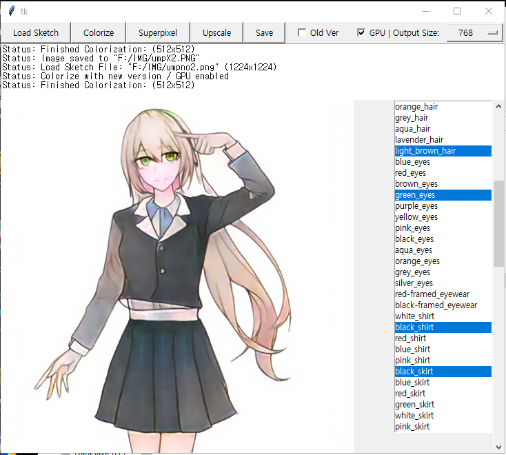

# Tag2Pix: Line Art Colorization Using Text Tag With SECat And Changing Loss (ICCV 19')

[Tag2Pix](https://github.com/blandocs/Tag2Pix) - GUI Version

> **Tag2Pix: Line Art Colorization Using Text Tag With SECat and Changing Loss** 
> Hyunsu Kim∗, Ho Young Jhoo∗, Eunhyeok Park, and Sungjoo Yoo (\* equal contribution)  
> Seoul National University
> 
> **Abstract:** *Line art colorization is expensive and challenging to automate. A GAN approach is proposed, called Tag2Pix, of line art colorization which takes as input a grayscale line art and color tag information and produces a quality colored image. First, we present the Tag2Pix line art colorization dataset. A generator network is proposed which consists of convolutional layers to transform the input line art, a pre-trained semantic extraction network, and an encoder for input color information. The discriminator is based on an auxiliary classifier GAN to classify the tag information as well as genuineness. In addition, we propose a novel network structure called SECat, which makes the generator properly colorize even small features such as eyes, and also suggest a novel two-step training method where the generator and discriminator first learn the notion of object and shape and then, based on the learned notion, learn colorization, such as where and how to place which color. We present both quantitative and qualitative evaluations which prove the effectiveness of the proposed method.*

## Dependencies

* Python 3.6+
* Pytorch 1.1.0
* numpy
* Pillow
* scikit-image

## How to Run

1. Download every network dump from [Tag2Pix releases](https://github.com/blandocs/tag2pix/releases). Place those three dumps under the root tag2pix-gui directory.
2. (Optional) Download [waifu2x-caffe](https://example.org) and place it to waifu2x-caffe directory. (waifu2x-caffe-cui.exe should be in this directory)
2. Install Dependencies
3. `python main.py`

## Usage 

1. Load Sketch
2. Select tags you want to colorize. (We recommend to colorize with `white_background`)
3. Press Colorize 
4. Upscale (with waifu2x-caffe) (Optional, Windows only)
5. Save

# LICENSE

This program and network dumps can be used for non-commercial, research purpose only.
(Due to the [LICENSE](https://github.com/bobbens/sketch_simplification/blob/master/LICENSE) of Sketch Simplification.)

If you want to use it for commercial purpose, re-train the full tag2pix network with the methods of our paper.

(The license of original non-GUI [Tag2Pix](https://github.com/blandocs/tag2pix) code is distributed under MIT License.)

학습 데이터 및 사용 네트워크의 라이센스 문제로 인해, 본 리포지토리의 코드 및 네트워크 덤프 파일의 배포 및 사용과 채색 결과는 비상업적 이용 및 연구 목적으로만 이용할 수 있습니다. 

